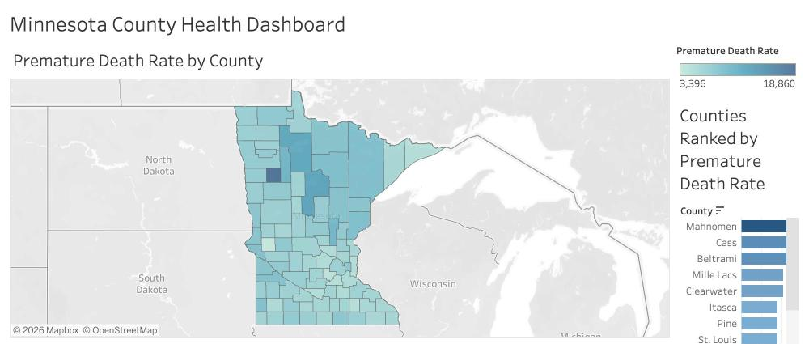

# Minnesota County Health Dashboard (Tableau)

**Live dashboard:** [View on Tableau Public](https://public.tableau.com/app/profile/seraphim.ikuomola1586/viz/MinnesotaCountyHealthDashboard/MinnesotaCountyHealthDashboard)

An interactive Tableau dashboard showing health outcome measures across Minnesota's 87 counties, built from a dataset I cleaned and prepared for Tableau.

## What the dashboard shows

- **Premature Death Rate by County:** a filled map of all 87 counties, colored by premature death rate. Hover over a county to see its name and rate.
- **Counties Ranked by Premature Death Rate:** a bar chart sorting counties from highest to lowest.
- **Adult Obesity vs Preventable Hospital Stays:** a scatter plot with one dot per county, to see whether the two measures rise together. It shows a pattern, not cause and effect.

## Why I built it

I wanted to practice preparing a real dataset for a BI tool and then build and publish a working dashboard from it.

## What's in this repo

- `MinnesotaCountyHealthDashboard.twbx`: the Tableau workbook (open it in Tableau Desktop or Tableau Public)
- `dashboard.png`: screenshot of the dashboard
- `mn_county_health_tableau_ready.csv`: 87 MN counties, the same 4 health measures used in the SQL and Python projects in this portfolio, plus a percentile rank for each measure
- `DASHBOARD_DESIGN.md`: the original dashboard plan, including a suggested calculated field for a composite risk score

## How I built it

1. Cleaned the data and added FIPS codes so Tableau could map every county correctly (matching on county names only mapped 53 of 87).
2. Set the FIPS code field's geographic role to County and built the filled map.
3. Built the ranking bar chart and the scatter plot.
4. Combined all three into one dashboard and published it to Tableau Public.

## Data source

County Health Rankings & Roadmaps, 2025/2026 measure release. See the companion SQL project's README for full source details.
